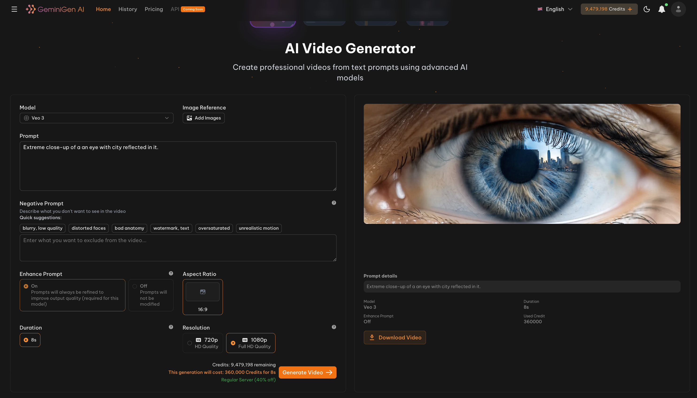

# AI Video Generator API — Veo 3

AI Video Generator API — Veo 3 by GeminiGenAI. Create stunning AI videos with Google’s Veo 3 at . Features include text-to-video, imagen-to-video, video editing, and cinematic-quality generation — with voice and sound for developers and creators. 👉 <a href="https://geminigen.ai/pricing" target="_blank">Check Pricing</a>.

> [!NOTE]  
> If you want a full editor, consider [Geminigen video editor](https://geminigen.ai/app/video-gen) - a web app makes video creation and editing effortless, with powerful AI options, intuitive tools, and a clean, user-friendly interface designed for everyone. Along with <a href="https://ainnate-geminigen.github.io/GEMINIGEN.AI-API-DEMO/" target="_blank">a dedicated platform</a> that lets users with API access generate videos effortlessly.

## ✨ Features

**Veo 3** is Google’s most advanced and versatile video generation model.
It enables you to create and edit high-quality videos seamlessly through natural conversation, blending cinematic realism with creative flexibility.

With this state-of-the-art model at the core, our app unlocks a suite of powerful tools designed to make video production effortless and inspiring:

## ✨ Features  

- **🌐 Full-Featured Web App** — Seamless UI for creating and editing videos with powerful AI tools (model selector, prompt editor, negative prompts, image reference, live cost estimate, and generate button).  
- **🎬 Text-to-Video Generation** — Generate cinematic-quality clips from simple text prompts with natural motion and frame-consistent details.  
- **❌ Negative Prompt Support** — Tell the model what to avoid (quick suggestions shown in UI: *blurry, low quality, distorted faces, bad anatomy, watermark, text, oversaturated, unrealistic motion*).  
- **✨ Prompt Enhancement** — Automatic prompt refinement to improve output quality (On by default / required for Veo 3 in the UI; option to turn Off if desired).  
- **🖼️ Image Reference Support** — Upload one or more images to guide scene composition, character look, or style continuity.  
- **📐 Flexible Aspect Ratios** — Preset options (16:9, 1:1, 9:16, 3:4, or custom) so outputs match YouTube, TikTok, Instagram, or presentation needs.  
- **⏱️ Adjustable Duration** — Choose clip length (e.g., 4s, 8s, etc.) — UI shows duration selector (8s selected in the screenshot).  
- **🖥️ Resolution & Quality** — Choose HD/Full HD (720p or 1080p) and preview expected quality before generating.  
- **🔍 Interactive Examples & Side-by-Side Previews** — Compare variations and view previews to iterate quickly.  
- **🔗 Developer-Friendly API** — Control model, duration, aspect ratio, resolution, prompt/negative prompt, and reference images via simple endpoints.  
- **🔁 Multiple Models Supported** — Editor supports **Veo 2**, **Veo 3**, and **Veo 3 Fast**, so you can pick cinematic quality, balanced performance, or ultra-fast generation.  

👉 In addition to Veo 3, our editor also supports Veo 2 and Veo 3 Fast, giving you the flexibility to choose between cinematic quality, balanced performance, and ultra-fast generation speeds.

## 🎯 Usage Guide

### 🎬 Creating Videos

1. **Choose Model** — Select an AI model (_Veo 2_, _Veo 3_, or _Veo 3 Fast_) depending on your needs: cinematic quality, balanced, or ultra-fast generation.  
2. **Enter a Prompt** — Write a clear, detailed description of the video you want to create.  
3. **Add a Negative Prompt (Optional)** — Specify what you don’t want in the video (e.g., *blurry, low quality, distorted faces, bad anatomy, watermark, oversaturated, unrealistic motion*).  
4. **Enable Prompt Enhancement** — Keep **Enhance Prompt: On** (default and required for Veo 3) for refined, higher-quality results.  
5. **Upload Reference (Optional)** — Add one or more images to guide scene composition, characters, or style.  
6. **Set Aspect Ratio** — Choose from presets (16:9, 1:1, 9:16, 3:4) or customize for platforms like YouTube, TikTok, or Instagram.  
7. **Set Duration** — Adjust video length (e.g., 4s, 8s, or longer depending on credits).  
8. **Select Resolution** — Pick **720p (HD)** for speed or **1080p (Full HD)** for maximum quality.  
9. **Check Credits & Cost** — Review the displayed estimate (e.g., *120,000 credits for 8s*) before generating.  
10. **Generate Video** — Click **Generate Video** to start. After processing, your result will be available in the preview area or via the notifications panel.  

### 💡 Tips for Best Results

- ✍️ **Be specific**: The more detailed your prompt, the better the result.
- 🖼️ **Use references**: Upload reference images to improve consistency.
- 🎨 **Experiment with styles**: Try different artistic styles (Anime, Ghibli, Realistic, Cinematic).
- ⚡ **Choose the right server**: Use VIP server for faster, priority generation.
- 📐 **Set aspect ratios**: Adjust image dimensions to match your use case (social media, banners, thumbnails).

## 🎬 Results & Examples

See the power of AI **video generation** in action. Easily create cinematic clips with prompts, aspect ratios, durations, and reference images.  
We will take the example: **generate a short cinematic landscape video**.

**🎯 Prompt Example:**

> Extreme close-up of a an eye with city reflected in it.

**⚙️ Settings:**
- Model: **Veo 3**
- Aspect Ratio: **16:9**
- Duration: **8s**
- Resolution: **1080p**
- Prompt Enhancement: **On**

**📽️ Output Video:**

<image src="assets/videos/veo3-example.gif" controls width="100%"></image>

## 🤝 Contributing

We warmly welcome contributions in the form of:

- 💡 **Feature Suggestions** — Share ideas to improve or expand the app’s capabilities.
- 🛠 **Enhancements** — Propose improvements to performance, UI/UX, or AI model usage.
- 🐞 **Bug Reports** — Help us identify and fix issues to ensure a smooth user experience.
- 📈 **Collaboration** — We are open to discussions about potential partnerships or integrations.

👉 If you’d like to contribute, please reach out via **Issues** or contact us directly at [contact@geminigen.ai](mailto:contact@geminigen.ai)

## 🔗 Links & Resources

- 👨‍💻 **Our website:** [https://geminigen.ai](https://geminigen.ai/)
- 📚 **Our API Documentation:** [https://docs.geminigen.ai](https://docs.geminigen.ai/)
